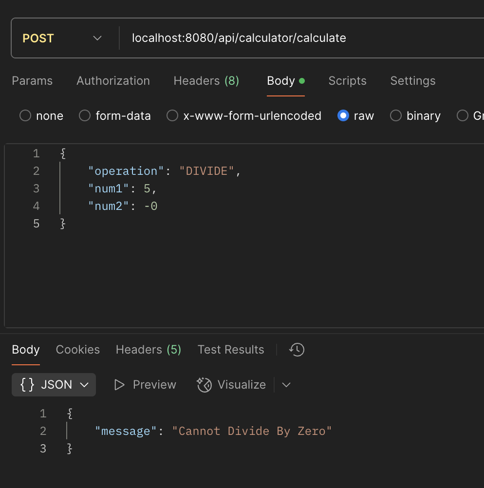
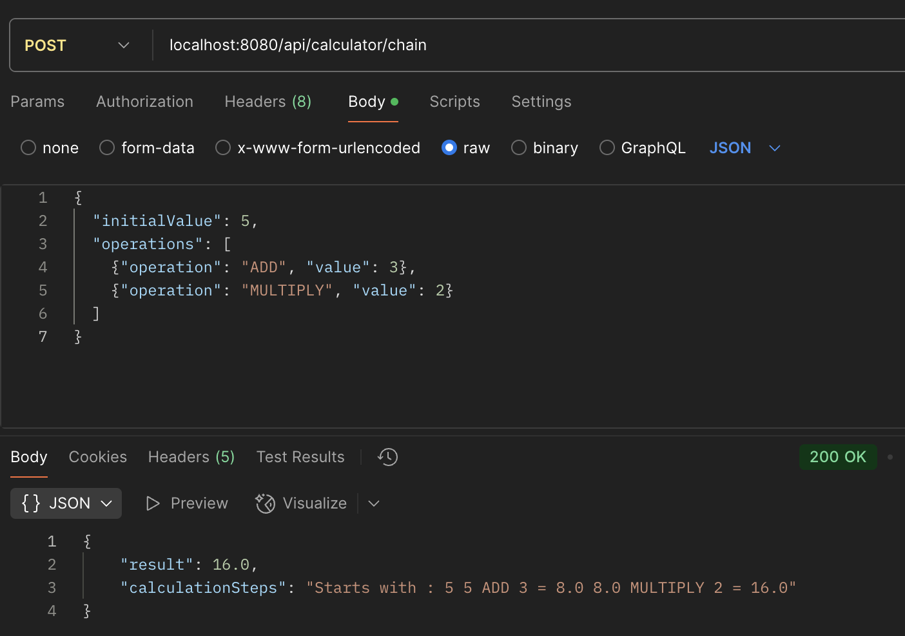
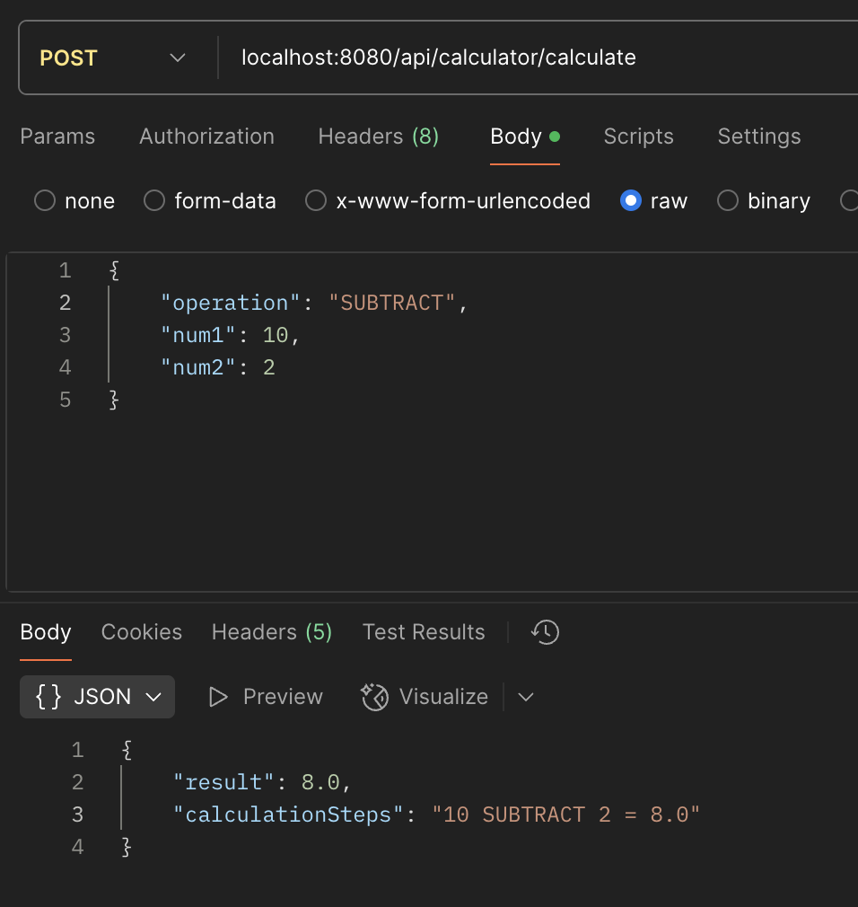

# Ebay-Assignment
# Calculator API

## Table of Contents
1. [Project Overview](#project-overview)
2. [Tech Stack](#tech-stack)
3. [API Documentation](#api-documentation)
---

## Project Overview
A calculator API built with Spring Boot that supports:
- Basic arithmetic operations (ADD, SUBTRACT, MULTIPLY, DIVIDE)
- Chained operations
- Robust error handling
- Clean, maintainable architecture following OOP principles

---

## Tech Stack
| Component           | Technology           |
|--------------------|----------------------|
| **Backend**         | Java 17, Spring Boot 3.x |
| **Build Tool**       | Maven |
| **Testing**         | JUnit 5, Mockito |

---

## API Documentation

### **Base URL**  
http://localhost:8080/api/calculator


---

### **Endpoints**

#### 1. Basic Calculation
**POST** `/calculate`

**Request Body:**
```json
{
  "operation": "DIVIDE",
  "num1": 10,
  "num2": 2
}
```
**Success Response:**
```
{
  "result": 5.0,
  "calculationSteps": "10 DIVIDE 2 = 5.0"
}
```

#### 2. Chain Calculation 
**POST** `/chain`

**Request Body:**
```json
{
  "initialValue": 5,
  "operations": [
    {"operation": "ADD", "value": 3},
    {"operation": "MULTIPLY", "value": 2}
  ]
}
```
**Success Response:**
```
{
  "result": 16.0,
  "calculationSteps": "Starts with : 5 5 ADD 3 = 8.0 8.0 MULTIPLY 2 = 16.0"
}
```

---

## Error Response
| Error Case | Status Code | Response Example                   | 
|------|--|------------------------------------|
| **Divide by zero** | 406 Not Acceptable | {"message":"Cannot Divide By Zero"} |
| **Invalid input** | 400 Bad Request | {"message":"Input cannot be null"} |
| **Unsupported operation** | 400 Bad Request | {"message":"This Operation is Not Supported"}|

---

## ScreenShots






